# PYTHON_LABS
## Лабораторная работа 1
### Задание 1
```Python
name = input("Напиши своё имя: ")
age = int(input("Теперь напиши свой возраст: "))
print(f"Привет, {name}! Через год тебе будет {age + 1}")
```


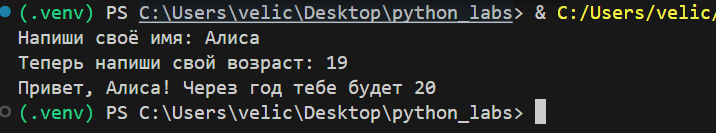

---

### Задание 2
```Python
def ctf(value):
    return float(value.replace(',', '.'))

a_input = input("a: ").strip()
b_input = input("b: ").strip()

a = ctf(a_input)
b = ctf(b_input)
total = a + b
avg = total / 2

print(f"sum={total:.2f}; avg={avg:.2f}")
```
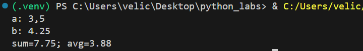

---

### Задание 3
```Python
price = float(input("Введите цену в рублях: "))
discount = float(input("Введите скидку в процентах: "))
vat = float(input("Введите размер НДС в процентах: "))

base = price * (1 - discount/100)
vat_amount = base * (vat/100)
total = base + vat_amount

print(f"База после скидки: {base:10.2f} ₽")
print(f"НДС: {vat_amount:10.2f} ₽")
print(f"Итого к оплате: {total:10.2f} ₽")
```
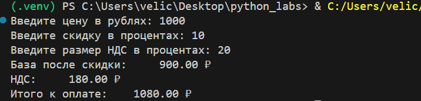

---

### Задание 4
```Python
m = int(input("Минуты: "))

hours = m // 60 
minutes = m % 60 

print(f"{hours}:{minutes:02d}")
```
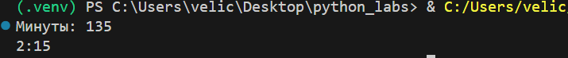

---

### Задание 5
```Python
full_name = input("ФИО: ")

cleaned_name = " ".join(full_name.split())
parts = cleaned_name.split()

initials = "".join(part[0].upper() for part in parts if part)

print(f"Инициалы: {initials}.")
print(f"Длина (символов): {len(cleaned_name)}")
```
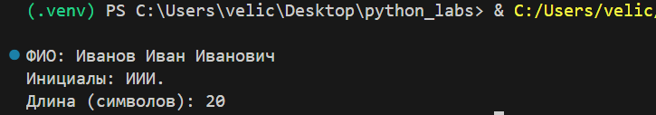

---

### Задание 6*
```Python
n = int(input().strip())
count_offline = 0
count_online = 0

for _ in range(n):
    data = input().split()
    
    if len(data) >= 4:
        format_str = data[-1]
        if format_str == "True":
            count_offline += 1
        elif format_str == "False":
            count_online += 1

print(f"{count_offline} {count_online}")
```
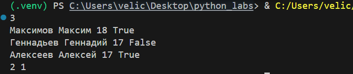

---

## Лабораторная работа 2
### Задание 1
```Python
def min_max(nums: list[float | int]) -> tuple[float | int, float | int]:
    if not nums:
        raise ValueError("Список не может быть пустым")
    return min(nums), max(nums)

def unique_sorted(nums: list[float | int]) -> list[float | int]:
    return sorted(set(nums))

def flatten(mat: list[list | tuple]) -> list:
    result = []
    for item in mat:
        if not isinstance(item, (list,tuple)):
            raise TypeError(f'Элемент {item} не является списком/кортежем')
        result.extend(item)
    return result
```
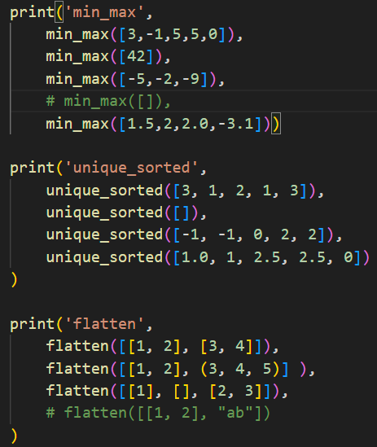
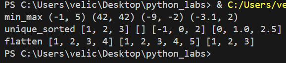
---
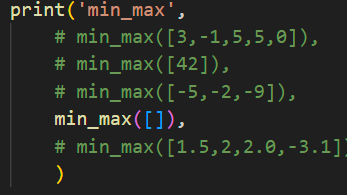
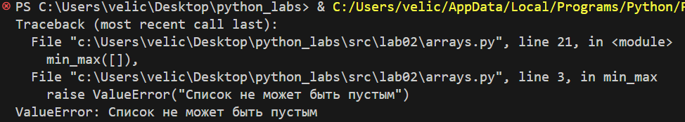
---
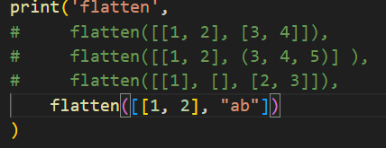
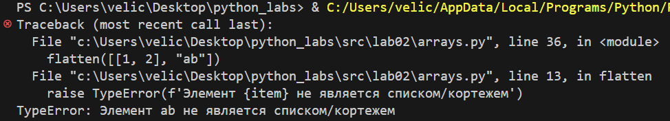

---

### Задание B
```Python
def transpose(mat: list[list[float | int ]]) -> list[list]:
    if not mat:
        return []
    
    row_length = len(mat[0])
    for i, row in enumerate(mat):
        if len(row) != row_length:
            raise ValueError(f"Строка {i} имеет длину {len(row)}, ожидалось {row_length}")
        
    return [[row[j] for row in mat] for j in range(len(mat[0]))]


def row_sums(mat: list[list[float | int]]) -> list[float]:
    if not mat:
        return []
    
    first_row_len = len(mat[0])
    for row in mat:
        if len(row) != first_row_len:
            raise ValueError("Матрица должна быть прямоугольной")

    sums = []
    for row in mat:
        sums.append(sum(row))
    return sums


def col_sums(mat: list[list[float | int]]) -> list[float]:
    if not mat:
        return []
    
    first_row_len = len(mat[0])
    for row in mat:
        if len(row) != first_row_len:
            raise ValueError("Матрица должна быть прямоугольной")
        
    num_cols = len(mat[0])
    sums = []
        
    for j in range(num_cols):
        column_sum = 0
        for row in mat:
            column_sum += row[j]
        sums.append(column_sum)
        
    return sums
```
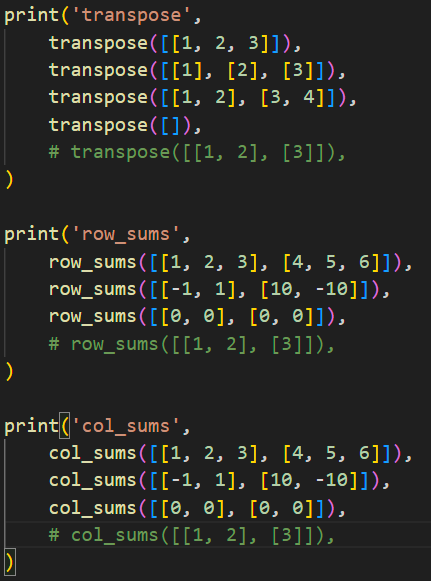
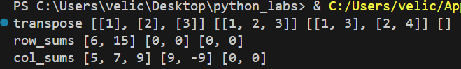
---
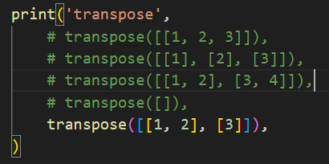
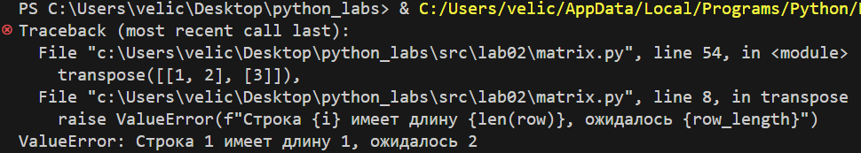
---
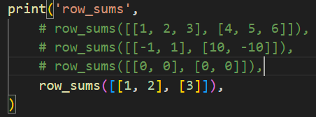
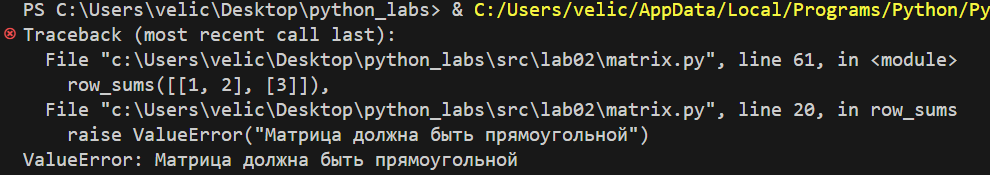
---
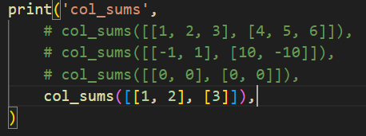
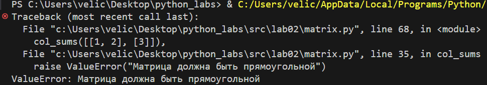

---

### Задание C
```Python
def format_record(rec: tuple[str, str, float]) -> str:
    # Проверка типов
    if not isinstance(rec, tuple) or len(rec) != 3:
        raise TypeError("Запись должна быть кортежем из 3 элементов")
    
    fio, group, gpa = rec
    
    if not isinstance(fio, str):
        raise TypeError("ФИО должно быть строкой")
    if not isinstance(group, str):
        raise TypeError("Группа должна быть строкой")
    if not isinstance(gpa, (int, float)):
        raise TypeError("GPA должно быть числом")
    
    # Обработка и валидация ФИО
    fio_clean = ' '.join(fio.split()).strip() 
    if not fio_clean:
        raise ValueError("ФИО не может быть пустым")
    
    # Обработка и валидация группы
    group_clean = group.strip()
    if not group_clean:
        raise ValueError("Группа не может быть пустой")
    
    # Валидация GPA
    if gpa < 0:
        raise ValueError("GPA не может быть отрицательным")
    
    # Форматирование ФИО с инициалами
    fio_parts = fio_clean.split()
    surname = fio_parts[0].title()
    
    # Формируем инициалы из оставшихся частей (1-2 имени)
    initials = []
    for name_part in fio_parts[1:3]:
        if name_part.strip():
            initials.append(f"{name_part[0].upper()}.")
    
    # Если нет имен, добавляем пустой инициал
    if not initials:
        initials = [""]
    
    fio_formatted = f"{surname} {''.join(initials)}".strip()
    
    # Форматирование GPA с 2 знаками после запятой
    gpa_formatted = f"{gpa:.2f}"
    
    return f"{fio_formatted}, гр. {group_clean}, GPA {gpa_formatted}"
```
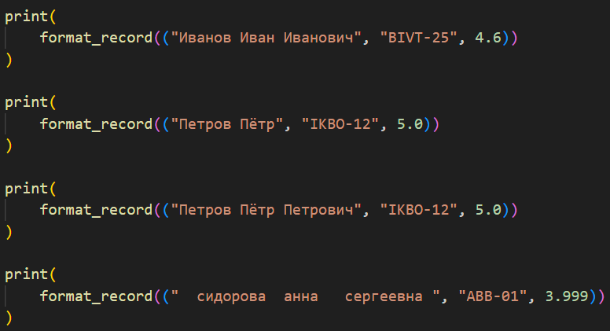
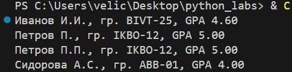
---
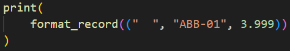
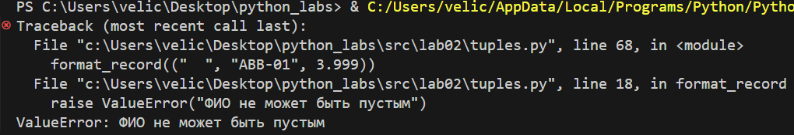

---

## Лабораторная работа 3
### Задание A
```Python
import re
from collections import Counter
from typing import Dict, List, Tuple


def normalize(text: str, *, casefold: bool = True, yo2e: bool = True) -> str:
    if yo2e:
        text = text.replace('Ё', 'Е').replace('ё', 'е')
    
    if casefold:
        text = text.casefold()
    
    text = re.sub(r'[\t\r\n]', ' ', text)
    
    text = ''.join(char for char in text if char.isprintable() or char.isspace())
    
    text = re.sub(r'\s+', ' ', text).strip()
    
    return text


def tokenize(text: str) -> List[str]:
    tokens = re.findall(r'\b[\w-]+\b', text)
    return tokens


def count_freq(tokens: List[str]) -> Dict[str, int]:
    return dict(Counter(tokens))


def top_n(freq: Dict[str, int], n: int = 5) -> List[Tuple[str, int]]:
    sorted_items = sorted(freq.items(), key=lambda x: (-x[1], x[0]))
    return sorted_items[:n]
```
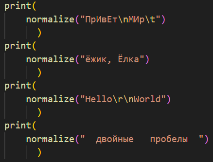
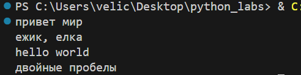
---
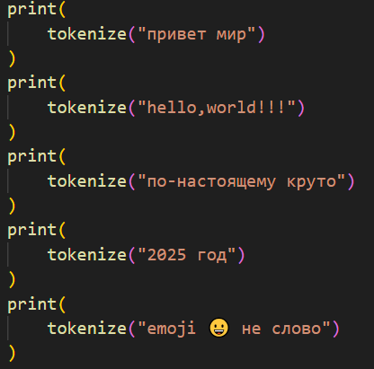
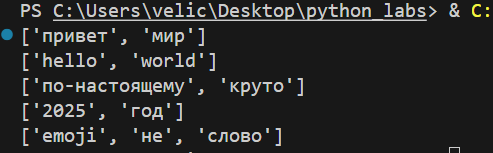
---
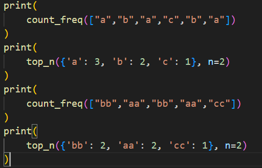
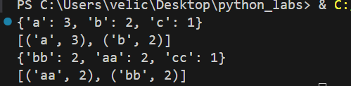

---

### Задание B
```Python
import sys
import os

# Добавляем путь к папке lib перед импортом
sys.path.append(os.path.join(os.path.dirname(__file__), '..', 'lib'))

from text import normalize, tokenize, count_freq, top_n

def script():
    text = input()
    # Получаем список всех словс
    text_corrected = tokenize(normalize(text))
    # Считаем общее кол-во слов
    count_words = len(text_corrected)
    # Получаем словарь уникальных слов
    dict_words = count_freq(text_corrected)
    # Считаем кол-во уникальных слов
    count_words_unique = len(dict_words)
    # Сортируем словарь по кол-ву слов
    dict_words_sort = top_n(dict_words)

    print(f'Всего слов: {count_words}')
    print(f'Уникальных слов: {count_words_unique}')
    print()
    print('Топ 5:')
    k = 0
    print(f'{"слово":^15} | {"частота":^15}')
    print(f'{"-"*15}-|-{"-"*15}')
    for word, counts in dict_words_sort:
        if k == 5:
            break
        k += 1
        print(f'{word:^15} | {counts:^15}')

if __name__ == "__main__":
    script()
```
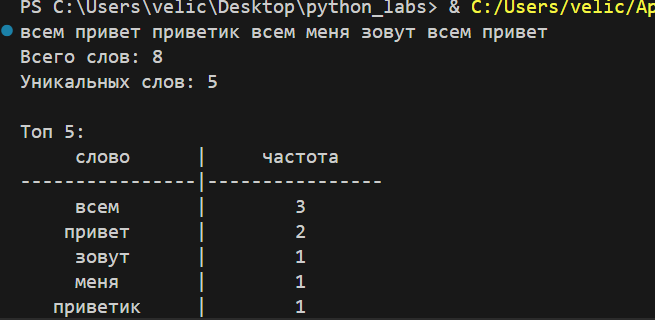

---

## Лабораторная работа 4
### Описание

Реализован модуль для анализа текстовых файлов и генерации отчетов о частоте слов в формате CSV.

---

### Задание A — модуль src/lab04/io_txt_csv.py
Код:
```Python
import csv
from pathlib import Path
from typing import Iterable, Sequence


def read_text(path: str | Path, encoding: str = "utf-8") -> str:
    p = Path(path)
    return p.read_text(encoding=encoding)


def write_csv(rows: Iterable[Sequence], path: str | Path, 
              header: tuple[str, ...] | None = None) -> None:
    p = Path(path)
    rows = list(rows)
    
    if rows:
        first_length = len(rows[0])
        for i, row in enumerate(rows):
            if len(row) != first_length:
                raise ValueError(f"Строка {i} имеет длину {len(row)}, ожидается {first_length}")
    
    ensure_parent_dir(p)
    
    with p.open("w", newline="", encoding="utf-8") as f:
        writer = csv.writer(f)
        if header is not None:
            writer.writerow(header)
        writer.writerows(rows)


def ensure_parent_dir(path: str | Path) -> None:
    p = Path(path)
    p.parent.mkdir(parents=True, exist_ok=True)
```
#### Тесты:
1) Тест для read_text():

Код проверки:

.png)

input.txt:

.png)

Консоль:

.png)
---
2)  Тест для write_csv():

Код проверки:

.png)

test1.csv:

.png)

Консоль:

.png)
---
3)  Тест для ensure_parent_dir():

Код проверки:

.png)

Созданные дирректории:

.png)

Консоль:

.png)
---

### Задание B — скрипт src/lab04/text_report.py
Код:
```Python
import sys
from pathlib import Path
import os
from collections import Counter

sys.path.append(os.path.join(os.path.dirname(__file__), '..', 'lib'))

from text import normalize, tokenize

from io_txt_csv import read_text, write_csv


def frequencies_from_text(text: str) -> dict[str, int]:
    normalized_text = normalize(text)
    tokens = tokenize(normalized_text)
    return Counter(tokens)


def sorted_word_counts(freq: dict[str, int]) -> list[tuple[str, int]]:
    return sorted(freq.items(), key=lambda kv: (-kv[1], kv[0]))


def print_summary(freq: dict[str, int], top_n: int = 5) -> None:
    total_words = sum(freq.values())
    unique_words = len(freq)
    
    print(f"Всего слов: {total_words}")
    print(f"Уникальных слов: {unique_words}")
    
    if unique_words > 0:
        sorted_words = sorted_word_counts(freq)
        top_words = sorted_words[:top_n]
        print(f"Топ-{top_n}: {', '.join(f'{word}({count})' for word, count in top_words)}")


def main():
    try:
        # Чтение входного файла
        input_file = Path("data/lab04/input.txt")
        text = read_text(input_file)
        
        # Вычисление частот
        freq = frequencies_from_text(text)
        
        # Подготовка данных для CSV
        sorted_counts = sorted_word_counts(freq)
        csv_data = [(word, count) for word, count in sorted_counts]
        
        # Запись отчета
        output_file = Path("data/lab04/report.csv")
        write_csv(csv_data, output_file, header=("word", "count"))
        
        # Вывод статистики
        print_summary(freq)
        print(f"\nОтчет сохранен в: {output_file}")
        
    except FileNotFoundError:
        print(f"Ошибка: Файл {input_file} не найден")
        sys.exit(1)
    except Exception as e:
        print(f"Ошибка: {e}")
        sys.exit(1)


if __name__ == "__main__":
    main()
```
#### Обработка входного файла

Скрипт поддерживает два способа указания входного файла:

##### 1. Хардкодированный путь (по умолчанию)
Если запустить скрипт без параметров, он автоматически использует файл:
`data/lab04/input.txt`


**Пример:**
```bash
python src/lab04/text_report.py
```

#### 2. Через параметры командной строки
Можно указать произвольный входной файл с помощью параметра `--in`:

Пример:
```bash
python src/lab04/text_report.py --in data/my_text.txt
python src/lab04/text_report.py --in /full/path/to/file.txt
```
##### Приоритет использования:

1) Если указан параметр `--in` - используется указанный файл

2) Если параметр не указан - используется хардкодированный путь data/lab04/input.txt

##### Обработка ошибок:

1) Если файл не существует - выводится ошибка и скрипт завершается

2) Рекомендуется использовать относительные пути от корня проекта

#### Использование входного файла

**По умолчанию:** скрипт читает файл `data/lab04/input.txt`

**С указанием файла:** использовать параметр `--in`
```bash
python src/lab04/text_report.py --in data/my_file.txt
```
---

### Тест-кейсы text_report

#### A. Один файл (база):

1) Вход (data/input.txt):

.png)

2) Полученный report.csv:

.png)

3) Консоль:

.png)

#### B. Пустой файл:

1) Вход:

.png)

2) Полученный report.csv:

.png)

3) Консоль:

.png)


## Лабораторная работа 4
### Описание
```bash
Реализация модулей для конвертации данных между форматами JSON, CSV и XLSX. 
Программа обеспечивает двустороннее преобразование JSON↔CSV и создание 
Excel-файлов из CSV с автоматическим форматированием.
```
---
### Команды запуска
```Python
# Установка зависимостей
pip install openpyxl

# Запуск тестов
python test_lab5.py
```
---
### Описание функции json_to_csv:
```bash
Конвертирует JSON-файл в CSV-формат. Поддерживает списки словарей, 
автоматически определяет все поля и сортирует их в алфавитном порядке. 
Отсутствующие значения заполняются пустыми строками.
```
#### Код:
```Python
def json_to_csv(json_path: str, csv_path: str) -> None:
    """
    Преобразует JSON-файл в CSV.
    Поддерживает список словарей [{...}, {...}], заполняет отсутствующие поля пустыми строками.
    Кодировка UTF-8. Порядок колонок — алфавитный.
    """
    json_file = Path(json_path)
    
    # Проверка существования файла
    if not json_file.exists():
        raise FileNotFoundError(f"JSON файл не найден: {json_path}")
    
    # Чтение JSON
    try:
        with json_file.open('r', encoding='utf-8') as f:
            data = json.load(f)
    except json.JSONDecodeError as e:
        raise ValueError(f"Ошибка декодирования JSON: {e}")
    except Exception as e:
        raise ValueError(f"Ошибка чтения файла: {e}")
    
    # Валидация данных
    if not data:
        raise ValueError("Пустой JSON или неподдерживаемая структура")
    
    if not isinstance(data, list):
        raise ValueError("JSON должен содержать список объектов")
    
    if not all(isinstance(item, dict) for item in data):
        raise ValueError("Все элементы JSON должны быть словарями")
    
    # Определение всех возможных полей (алфавитный порядок)
    fieldnames = set()
    for item in data:
        fieldnames.update(item.keys())
    fieldnames = sorted(fieldnames)
    
    if not fieldnames:
        raise ValueError("JSON не содержит полей для преобразования")
    
    # Запись CSV
    try:
        with open(csv_path, 'w', encoding='utf-8', newline='') as f:
            writer = csv.DictWriter(f, fieldnames=fieldnames)
            writer.writeheader()
            for row in data:
                # Заполняем отсутствующие поля пустыми строками
                complete_row = {field: str(row.get(field, '')) for field in fieldnames}
                writer.writerow(complete_row)
    except Exception as e:
        raise ValueError(f"Ошибка записи CSV: {e}")
```
#### Пример работы:
.png)
.png)
---
### Описание функции csv_to_json:
```bash
Конвертирует CSV-файл в JSON-формат. Автоматически определяет разделитель 
и использует первую строку как заголовок. Все значения сохраняются как строки.
```
#### Код:
```Python
def csv_to_json(csv_path: str, json_path: str) -> None:
    """
    Преобразует CSV в JSON (список словарей).
    Заголовок обязателен, значения сохраняются как строки.
    """
    csv_file = Path(csv_path)
    
    # Проверка существования файла
    if not csv_file.exists():
        raise FileNotFoundError(f"CSV файл не найден: {csv_path}")
    
    # Чтение CSV
    try:
        with csv_file.open('r', encoding='utf-8') as f:
            # Пробуем прочитать как CSV с заголовком
            reader = csv.DictReader(f)
            data = list(reader)
            
    except csv.Error as e:
        raise ValueError(f"Ошибка чтения CSV: {e}")
    except Exception as e:
        raise ValueError(f"Ошибка обработки CSV: {e}")
    
    # Валидация данных
    if not data:
        raise ValueError("CSV файл пуст или не содержит данных")
    
    # Проверяем что есть поля (значит был заголовок)
    if not reader.fieldnames:
        raise ValueError("CSV файл должен содержать заголовок")
    
    # Запись JSON
    try:
        with open(json_path, 'w', encoding='utf-8') as f:
            json.dump(data, f, ensure_ascii=False, indent=2)
    except Exception as e:
        raise ValueError(f"Ошибка записи JSON: {e}")
```
#### Пример работы:
.png)
.png)
---
### Описание функции csv_to_xlsx:
```bash
Создает XLSX-файл из CSV с автоматической настройкой ширины колонок. 
Минимальная ширина колонки - 8 символов. Используется лист с именем "Sheet1".
```
#### Код:
```Python
def csv_to_xlsx(csv_path: str, xlsx_path: str) -> None:
    """
    Конвертирует CSV в XLSX.
    Использовать openpyxl.
    Первая строка CSV — заголовок.
    Лист называется "Sheet1".
    Колонки — автоширина по длине текста (не менее 8 символов).
    """
    csv_file = Path(csv_path)
    
    # Проверка существования файла
    if not csv_file.exists():
        raise FileNotFoundError(f"CSV файл не найден: {csv_path}")
    
    # Чтение CSV
    try:
        with csv_file.open('r', encoding='utf-8') as f:
            # Просто читаем все строки CSV
            reader = csv.reader(f)
            data = list(reader)
            
    except Exception as e:
        raise ValueError(f"Ошибка чтения CSV: {e}")
    
    # Валидация данных
    if not data:
        raise ValueError("CSV файл пуст")
    
    # Проверяем что есть хотя бы одна строка (заголовок)
    if len(data) == 0:
        raise ValueError("CSV файл должен содержать заголовок")
    
    # Создание XLSX
    try:
        wb = Workbook()
        ws = wb.active
        ws.title = "Sheet1"
        
        # Запись данных
        for row in data:
            ws.append(row)
        
        # Авто-ширина колонок (не менее 8 символов)
        for column in ws.columns:
            max_length = 0
            column_letter = column[0].column_letter
            
            for cell in column:
                try:
                    cell_value = str(cell.value) if cell.value is not None else ""
                    if len(cell_value) > max_length:
                        max_length = len(cell_value)
                except:
                    pass
            
            adjusted_width = max(max_length + 2, 8)  # Минимум 8 символов
            ws.column_dimensions[column_letter].width = adjusted_width
        
        wb.save(xlsx_path)
        
    except Exception as e:
        raise ValueError(f"Ошибка создания XLSX: {e}")
```
#### Пример работы:
.png)
.png)
---
### Ключевые особенности:
- Единая кодировка UTF-8 для всех операций
- Полная валидация входных данных и обработка ошибок
- Автоматическое определение структуры CSV-файлов
- Поддержка относительных путей к файлам
- Использование только стандартной библиотеки кроме openpyxl
---
### Примеры использования:
```Python
from lab05 import json_to_csv, csv_to_json, csv_to_xlsx

# Конвертация JSON в CSV
json_to_csv('data/samples/people.json', 'data/out/people.csv')

# Конвертация CSV в JSON
csv_to_json('data/samples/people.csv', 'data/out/people.json')

# Создание XLSX из CSV
csv_to_xlsx('data/samples/cities.csv', 'data/out/cities.xlsx')
```
---
### Тест-файл test_lab5.py:
```bash
Тестовый скрипт проверяет все функции конвертации. Автоматически создает 
тестовые файлы если они отсутствуют, выполняет преобразования между форматами 
и сохраняет результаты в папку data/out/. Скрипт выводит статус каждой операции 
и сообщает об ошибках при их возникновении.
```
.png)
---
## Лабораторная работа 4

**CLI-УТИЛИТЫ С ARGPARSE**

### ЦЕЛЬ РАБОТЫ
Научиться создавать консольные инструменты с аргументами командной строки, подкомандами и флагами.
### ВЫПОЛНЕННЫЕ ЗАДАЧИ
### 1. МОДУЛЬ CLI_TEXT.PY
Создан модуль с двумя подкомандами:

**Команда STATS**

- Назначение: анализ частот слов в тексте

- Использует функции из lab03: normalize, tokenize, count_freq, top_n

- Параметры:
  - --input (обязательный) - путь к текстовому файлу
  - --top (опциональный) - количество топ-слов (по умолчанию 5)

СКРИНШОТ 2: Демонстрация работы команды stats

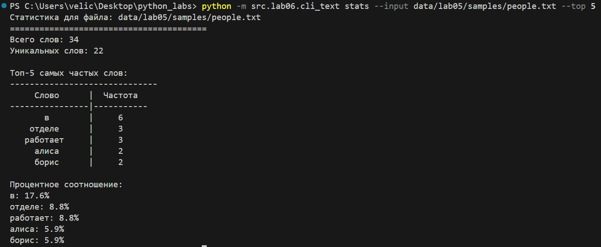

```bash
python -m src.lab06.cli_text stats --input data/lab05/samples/people.txt --top 5
```

**Команда CAT**

- Назначение: вывод содержимого файла построчно

- Параметры:
  - --input (обязательный) - путь к файлу
  - -n (опциональный) - нумерация строк

СКРИНШОТ 3: Демонстрация работы команды cat

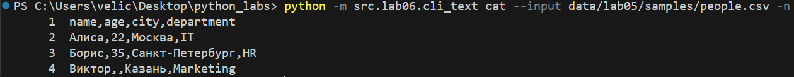

```bash
python -m src.lab06.cli_text cat --input data/lab05/samples/people.csv -n
```

### 2. МОДУЛЬ CLI_CONVERT.PY

Создан модуль с тремя подкомандами конвертации:

**Команда JSON2CSV**

- Назначение: конвертация JSON в CSV

- Использует функцию json_to_csv из lib

- Параметры:
  - --in (обязательный) - входной JSON файл
  - --out (обязательный) - выходной CSV файл

СКРИНШОТ 4: Демонстрация работы команды json2csv

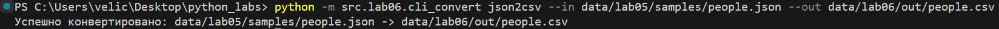

```bash
python -m src.lab06.cli_convert json2csv --in data/lab05/samples/people.json --out data/lab06/out/people.csv
```

**Команда CSV2JSON**

- Назначение: конвертация CSV в JSON

- Использует функцию csv_to_json из lib

- Параметры:
  - --in (обязательный) - входной CSV файл
  - --out (обязательный) - выходной JSON файл

СКРИНШОТ 5: Демонстрация работы команды csv2json

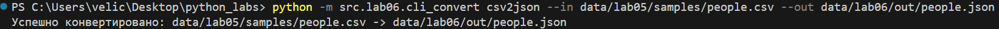

```bash
python -m src.lab06.cli_convert csv2json --in data/lab05/samples/people.csv --out data/lab06/out/people.json
```

**Команда CSV2XLSX**

- Назначение: конвертация CSV в XLSX

- Использует функцию csv_to_xlsx из lib

- Параметры:
  - --in (обязательный) - входной CSV файл
  - --out (обязательный) - выходной XLSX файл

СКРИНШОТ 6: Демонстрация работы команды csv2xlsx

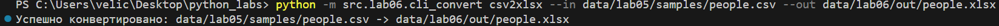

```bash
python -m src.lab06.cli_convert csv2xlsx --in data/lab05/samples/people.csv --out data/lab06/out/people.xlsx
```
---
### ПРОВЕРКА РАБОТОСПОСОБНОСТИ

---

### ПОДГОТОВКА ДАННЫХ

СКРИНШОТ 1: Структура исходных данных

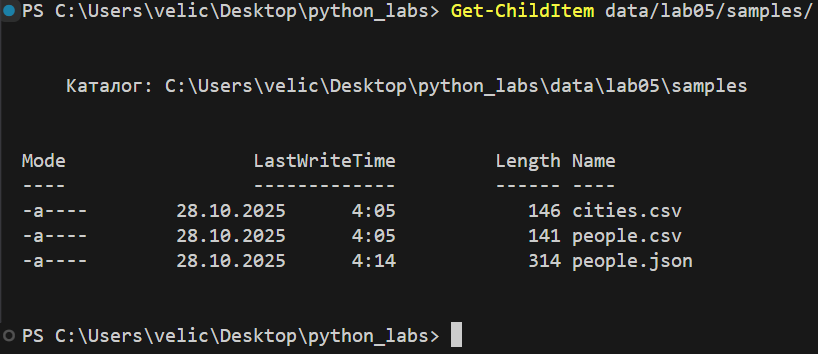

```bash
Get-ChildItem data/lab05/samples/
```


Использованы файлы из **lab05:**

- people.csv - данные о людях в CSV формате

- people.json - данные о людях в JSON формате

- cities.csv - данные о городах

- people.txt - текстовые данные для анализа (создан для демонстрации)

### ПРОВЕРКА СПРАВКИ

СКРИНШОТ 7: Справка по cli_text

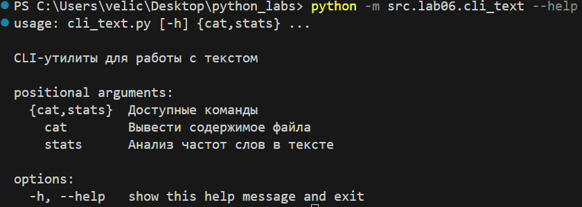

```bash
python -m src.lab06.cli_text --help
```
---
СКРИНШОТ 8: Справка по командам cli_text

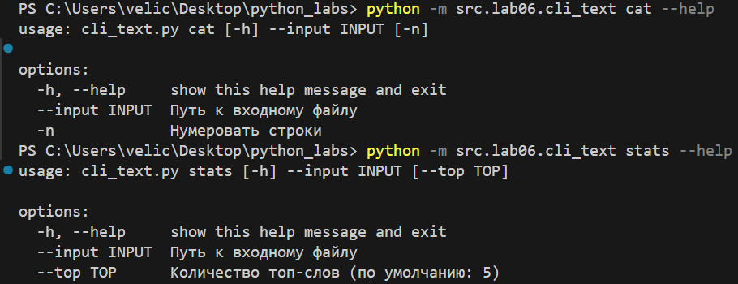

```bash
python -m src.lab06.cli_text cat --help
python -m src.lab06.cli_text stats --help
```
---
СКРИНШОТ 9: Справка по cli_convert

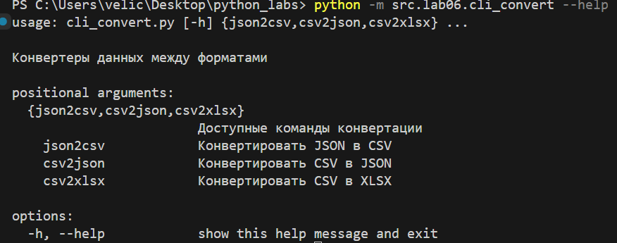

```bash
python -m src.lab06.cli_convert --help
```
---
СКРИНШОТ 10: Справка по командам конвертации

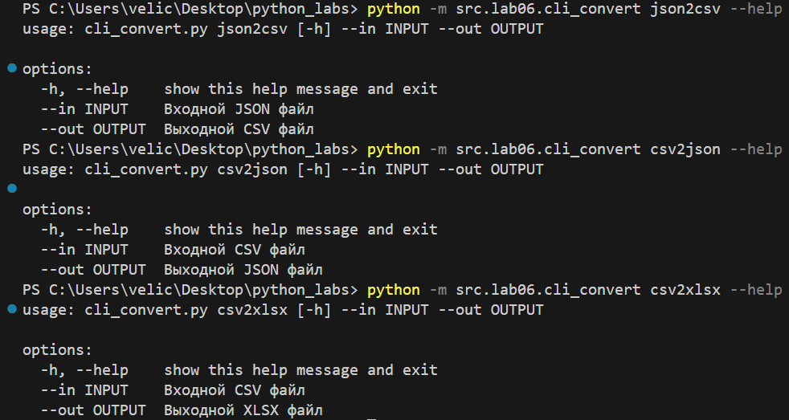

```bash
python -m src.lab06.cli_convert json2csv --help
python -m src.lab06.cli_convert csv2json --help
python -m src.lab06.cli_convert csv2xlsx --help
```

---

### ПРОВЕРКА РЕЗУЛЬТАТОВ

СКРИНШОТ 11: Созданные файлы в директории out

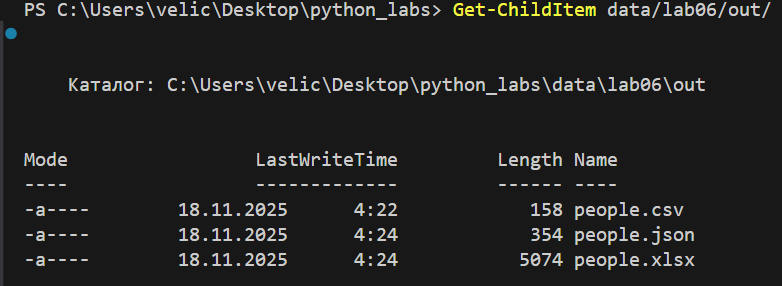

```bash
Get-ChildItem data/lab06/out/
```

Результаты конвертации:

- people.csv (158 байт) - конвертирован из JSON

- people.json (354 байт) - конвертирован из CSV

- people.xlsx (5074 байт) - конвертирован из CSV

---

### ПРОВЕРКА ОБРАБОТКИ ОШИБОК

СКРИНШОТ 12: Обработка несуществующего файла

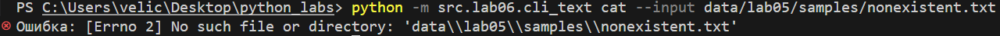

```bash
python -m src.lab06.cli_text cat --input data/lab05/samples/nonexistent.txt
```

---

### ВЫВОДЫ

1. Все требования технического задания выполнены

2. Созданы два CLI-модуля с подкомандами:

    - cli_text.py: cat, stats

    - cli_convert.py: json2csv, csv2json, csv2xlsx

3. Использованы функции из предыдущих лабораторных работ:

    - Из lab03: функции анализа текста

    - Из lab05: функции конвертации данных

    - Из lib: вспомогательные функции ввода-вывода

4. Реализована корректная обработка аргументов через argparse

5. Обеспечена обработка ошибок с понятными сообщениями

6. Все сценарии проверки из методички успешно пройдены

---

### ТЕХНИЧЕСКИЕ ДЕТАЛИ

- Использована только стандартная библиотека Python

- Применен модуль argparse для парсинга аргументов

- Реализована система подкоманд

- Обеспечена кроссплатформенная работа

- Вывод справки (--help) работает для всех подкоманд

Работа демонстрирует полноценные CLI-утилиты, готовые к использованию в производственной среде.